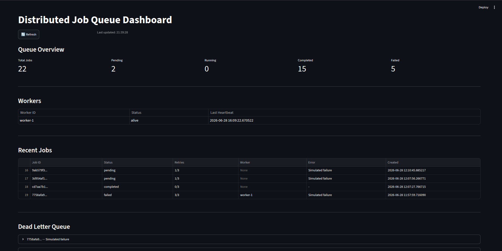
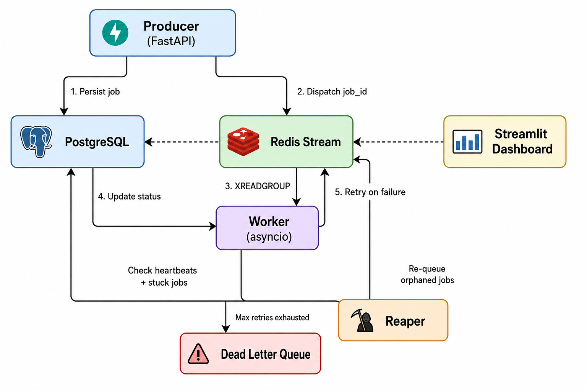

```markdown
# Distributed Job Queue


A production-grade distributed job queue built from scratch in Python. No Celery, no BullMQ — just Redis Streams, PostgreSQL, and raw engineering.

---

## Dashboard



---

## Why This Exists

Most developers reach for Celery without understanding what happens underneath. This project builds a job queue from first principles — the same way companies like Razorpay, Swiggy, and Zepto do it internally.

---

## Architecture



---

## Features

- **Redis Streams + Consumer Groups** — reliable job dispatch, no polling
- **PostgreSQL persistence** — every job stored with full audit trail
- **Atomic job claiming** — `UPDATE ... WHERE status = 'pending'` prevents duplicate processing
- **Exponential backoff** — failed jobs retry after 2s, 4s, 8s
- **Dead Letter Queue** — jobs that exhaust retries are marked failed with error message preserved
- **Idempotency keys** — same job submitted twice? Second request rejected with 409
- **asyncio timeout** — jobs that hang are cancelled after 10s and retried
- **Worker heartbeats** — workers register liveness every 5s in PostgreSQL
- **Worker ID tracking** — each job records which worker claimed it
- **Reaper process** — cross-references worker heartbeats before re-queuing stuck jobs
- **Health endpoint** — `/health` verifies PostgreSQL and Redis connectivity
- **Streamlit dashboard** — real-time queue monitoring with DLQ retry controls
- **Chaos tested** — Redis and worker killed mid-execution, zero data loss confirmed

---

## Tech Stack

- Python 3.10+, FastAPI, asyncio
- Redis Streams + Consumer Groups
- PostgreSQL + Alembic migrations
- Docker + Docker Compose
- Streamlit (dashboard)

---

## Getting Started

**Prerequisites:** Docker, Python 3.10+

**1. Clone the repo**
```bash
git clone https://github.com/Ujjwal-nayan/distributed-job-queue.git
cd distributed-job-queue
```

**2. Start Redis and PostgreSQL**
```bash
docker compose up -d
```

**3. Set up Python environment**
```bash
python3 -m venv venv
source venv/bin/activate
pip install -r requirements.txt
```

**4. Run database migrations**
```bash
alembic upgrade head
```

**5. Start all processes (separate terminals, venv activated in each)**
```bash
uvicorn main:app --reload     # API server
python3 worker.py              # Job worker
python3 reaper.py              # Stuck job recovery
streamlit run dashboard.py     # Monitoring dashboard
```

**Optional env vars:**
- `WORKER_NAME` — unique name per worker instance (default: `worker-1`)
- `STUCK_JOB_THRESHOLD` — seconds before reaper considers a job stuck (default: `30`)

---

## API

**Health check**
```bash
curl http://localhost:8000/health
```

**Create a job**
```bash
curl -X POST http://localhost:8000/jobs \
  -H "Content-Type: application/json" \
  -d '{"payload": {"task": "review_pr", "repo": "my-repo"}}'
```

**Create a job with idempotency key**
```bash
curl -X POST http://localhost:8000/jobs \
  -H "Content-Type: application/json" \
  -d '{"payload": {"task": "review_pr"}, "idempotency_key": "pr-42-review"}'
```

**Check job status**
```bash
curl http://localhost:8000/jobs/{job_id}
```

**Job status values:** `pending` → `running` → `completed` / `failed`

---

## Chaos Engineering

Simulates Redis failure and worker crash mid-execution to prove zero data loss:

```bash
./chaos_test.sh
```

Expected output:
```
Job 1 final status: completed
Job 2 final status: completed
```

---

## Design Decisions

- **Postgres is the source of truth** — jobs persisted to PostgreSQL before Redis dispatch. Redis goes down, no data lost.
- **Atomic claiming** — `UPDATE ... WHERE status = 'pending'` with `rowcount` check prevents race conditions.
- **Reaper checks heartbeats** — only re-queues jobs whose workers have stale heartbeats. Active long-running jobs left alone.
- **ACK even on skip** — Redis messages acknowledged even for skipped jobs, preventing infinite redelivery.
- **Idempotency at two layers** — Redis `SET NX` for fast detection, PostgreSQL `UNIQUE` constraint as final guard.

---

## Project Structure

```
├── main.py              # FastAPI server
├── worker.py            # Async worker
├── reaper.py            # Stuck job recovery
├── database.py          # DB and Redis connections
├── models.py            # Job model
├── dashboard.py         # Streamlit monitoring dashboard
├── dashboard.png        # Dashboard screenshot
├── architecture.png     # Architecture diagram
├── chaos_test.sh        # Chaos engineering test
├── migrations/          # Alembic migrations
├── docker-compose.yml   # Redis + PostgreSQL
└── requirements.txt
```
